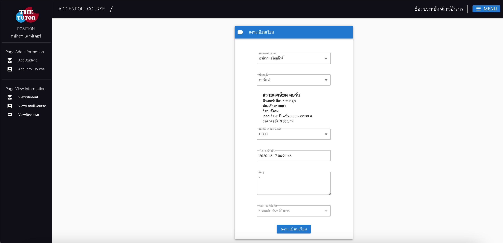
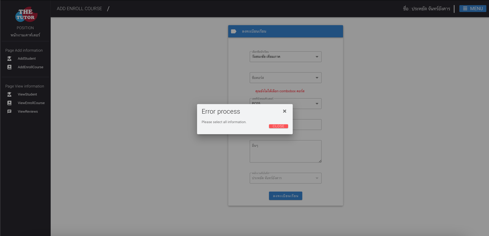

# SE - Team21 ระบบสถาบันติวเตอร์

### frontend using VueJS
* `cd frontend`
* `[node@12] npm install && yarn install`
* `yarn serve`
* `[open browser] http://localhost:8080/`

### backend using Spring Boot
* `cd backend`
* `[macOS] ./gradlew bootRun | gradlew bootRuno`
* `application.properties :`
  ```
  server.port = 9000
  spring.h2.console.enabled=true
  spring.h2.console.path=/db
  spring.datasource.url=jdbc:h2:mem:testdb
  spring.datasource.driverClassName=org.h2.Driver
  spring.datasource.username=sa
  spring.datasource.password=
  ```
### UX/UI - Test
* 1-หน้าหลัก.png
  <div style="text-align:center"></img></div>
* 2-เข้าสู่ระบบ-นร.png
  <div style="text-align:center"></img></div>
* 3-เข้าสู่ระบบ-ติวเตอร์.png
  <div style="text-align:center"></img></div>
* 4-เข้าสู่ระบบสำเร็จ.png
  <div style="text-align:center"></img></div>
* 5-เข้าสู่ระบบไม่สำเร็จ.png
  <div style="text-align:center"></img></div>
* 6-ตำเเหน่งของคุณไม่สามารถเข้าสู่ระบบได้.png
  <div style="text-align:center"></img></div>
* 7-ยินดีต้อนรับ.png
  <div style="text-align:center"></img></div>
* 8-ระบบจัดเก็บข้อมูลพนักงาน.png
  <div style="text-align:center"></img></div>
* 9-ตารางเเสดงข้อมูลพนักงาน.png
  <div style="text-align:center"></img></div>
* 10-ระบบสมัครสมาชิก.png
  <div style="text-align:center"></img></div>
* 11-ตารางเเสดงข้อมูลสมาชิก.png
  <div style="text-align:center"></img></div>
* 12-ระบบเพิ่มคอร์สเรียน.png
  <div style="text-align:center"></img></div>
* 13-ตารางเเสดงข้อมูลคอร์สเรียน.png
  <div style="text-align:center"></img></div>
* 14-รีวิวคอร์สเรียน.png
  <div style="text-align:center"></img></div>
* 15-ตารางรีวิวคอร์สเรียนจากผู้เรียน.png
  <div style="text-align:center"></img></div>
* 16-ระบบลงทะเบียนเรียน.png
  <div style="text-align:center"></img></div>
* 17-บันทึกข้อมูลสำเร็จ.png
  <div style="text-align:center"></img></div>
* 18-บันทึกข้อมูลไม่สำเร็จ.png
  <div style="text-align:center"></img></div>
* 19-ตารางเเสดงผลการลงทะเบียนเรียน.png
  <div style="text-align:center"></img></div>
* 19-ตารางเเสดงผลการลงทะเบียนเรียน.png
  <div style="text-align:center"></img></div>
* 20-ตารางเเสดงประวัติการใช้จ่าย.png
  <div style="text-align:center"></img></div>
* 21-ระบบบันทึกค่าใช้จ่าย.png
  <div style="text-align:center"></img></div>

### Team members
* นายณัฐวัตร นารินทร์ B6015695
* นายเกรียงไกร  บัวบาน B6014728
* นายพิชญตม์ อ่ำบุญ B6021511
* นายพงศกร มาประโคน B6005795
* นายปิยะพงษ์ กิตติชัยวัฒนา B6010768
* นายดำรงค์ เครือศรี B6010331


